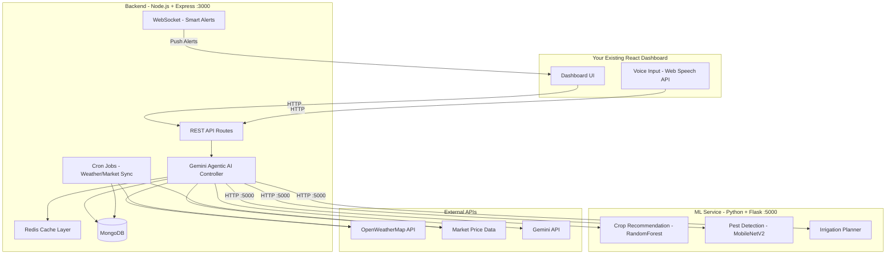
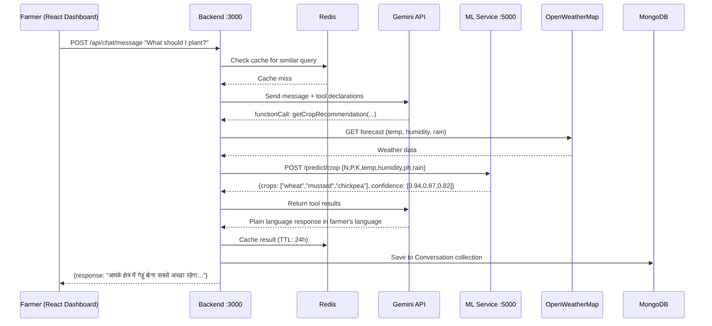

# AgriSense — Agentic AI for Farmers (Backend + ML Service)

Backend-only architecture: Node.js API server + Python ML microservice. No frontend, no Docker — just direct API endpoints your existing React dashboard can consume.

> [!IMPORTANT]
> **Core Philosophy:** Instead of demanding technical input, the system asks farmers simple questions ("Is your soil dry or wet?") and uses AI to reason through the complexity (NPK values, weather forecasts, market trends) behind the scenes.

---

## User Review Required

> [!WARNING]
> **API Keys Needed** — Add these to `backend/.env` before running:
> 1. **`GEMINI_API_KEY`** — from [Google AI Studio](https://aistudio.google.com/)
> 2. **`OPENWEATHER_API_KEY`** — free tier from [openweathermap.org](https://openweathermap.org/api)
> 3. **`MONGODB_URI`** — local `mongodb://localhost:27017/agrisense` or Atlas connection string
> 4. **`REDIS_URL`** — local `redis://localhost:6379` (install Redis or use Redis Cloud free tier)

> [!NOTE]
> **No Docker / No Frontend** — Services run directly via `npm run dev` and `python app.py`. Your existing React dashboard connects to these APIs.

---

## Open Questions

1. **Dataset for Crop Recommendation** — I'll use the standard Kaggle Crop Recommendation Dataset (N, P, K, temperature, humidity, pH, rainfall → crop). Do you have a custom dataset?
2. **Pest Detection Model** — I'll train a lightweight CNN (MobileNetV2 transfer learning) on PlantVillage dataset. Do you have your own pest/disease images?
3. **Market Prices** — India's Agmarknet doesn't have a stable public API. I'll use a mock data layer with realistic prices + MSP table. Acceptable?
4. **Languages** — Default: English, Hindi, Tamil, Telugu, Kannada, Marathi. Add/remove?

---

## Architecture Overview



---

## Folder Structure

```
AgriSense/
├── backend/                          # Node.js + Express
│   ├── src/
│   │   ├── config/
│   │   │   ├── db.js                 # MongoDB connection
│   │   │   ├── redis.js              # Redis client
│   │   │   └── env.js                # Environment config
│   │   ├── models/                   # Mongoose schemas
│   │   │   ├── User.js
│   │   │   ├── FarmProfile.js
│   │   │   ├── Conversation.js
│   │   │   ├── Alert.js
│   │   │   └── MarketPrice.js
│   │   ├── routes/                   # One route file per feature
│   │   │   ├── auth.routes.js
│   │   │   ├── crop.routes.js
│   │   │   ├── irrigation.routes.js
│   │   │   ├── pest.routes.js
│   │   │   ├── market.routes.js
│   │   │   ├── weather.routes.js
│   │   │   ├── alert.routes.js
│   │   │   ├── voice.routes.js
│   │   │   └── chat.routes.js
│   │   ├── controllers/              # Request handlers
│   │   │   ├── auth.controller.js
│   │   │   ├── crop.controller.js
│   │   │   ├── irrigation.controller.js
│   │   │   ├── pest.controller.js
│   │   │   ├── market.controller.js
│   │   │   ├── weather.controller.js
│   │   │   ├── alert.controller.js
│   │   │   ├── voice.controller.js
│   │   │   └── chat.controller.js
│   │   ├── services/                 # Core business logic
│   │   │   ├── gemini.service.js     # Gemini API + function calling (AGENT)
│   │   │   ├── weather.service.js    # OpenWeatherMap integration
│   │   │   ├── market.service.js     # Market price fetching + MSP
│   │   │   ├── ml.service.js         # HTTP proxy to Python ML service
│   │   │   ├── alert.service.js      # Smart alert rules engine
│   │   │   ├── voice.service.js      # Gemini TTS/translation
│   │   │   └── cache.service.js      # Redis caching abstraction
│   │   ├── middleware/
│   │   │   ├── auth.middleware.js
│   │   │   ├── upload.middleware.js   # Multer for pest image upload
│   │   │   ├── rateLimiter.js
│   │   │   └── errorHandler.js
│   │   ├── utils/
│   │   │   ├── logger.js
│   │   │   └── helpers.js
│   │   ├── jobs/                     # Scheduled background tasks
│   │   │   ├── weatherAlert.job.js   # Every 3h: weather → smart alerts
│   │   │   └── marketSync.job.js     # Every 6h: sync market prices
│   │   └── app.js                    # Express app setup + Socket.IO
│   ├── server.js                     # Entry point
│   ├── package.json
│   └── .env.example
│
├── MLservice/                        # Python + Flask
│   ├── app.py                        # Flask entry point (port 5000)
│   ├── models/
│   │   ├── crop_model.pkl            # Trained crop recommendation
│   │   ├── pest_model.h5            # Trained pest detection CNN
│   │   └── scaler.pkl                # Feature scaler
│   ├── training/
│   │   ├── train_crop.py             # Train crop model
│   │   ├── train_pest.py             # Train pest CNN
│   │   └── data/
│   │       └── crop_recommendation.csv
│   ├── services/
│   │   ├── crop_service.py
│   │   ├── pest_service.py
│   │   └── irrigation_service.py
│   └── requirements.txt
│
└── README.md
```

---

## Proposed Changes

### Component 1: ML Service (Python + Flask) — Port 5000

The intelligence layer. Trained ML models exposed as simple HTTP endpoints. Run with `python app.py`.

#### [NEW] MLservice/requirements.txt
```
flask==3.1.*
flask-cors==5.*
scikit-learn==1.6.*
tensorflow==2.19.*
pillow==11.*
numpy==2.*
pandas==2.*
joblib==1.*
gunicorn==23.*
```

#### [NEW] MLservice/app.py
- Flask app on port 5000 with CORS enabled
- Three prediction endpoints:

| Endpoint | Method | Input | Output |
|----------|--------|-------|--------|
| `/predict/crop` | POST | `{ N, P, K, temperature, humidity, ph, rainfall }` | Top 3 crops with confidence % |
| `/predict/pest` | POST | Multipart image file | Disease name, confidence, treatment |
| `/predict/irrigation` | POST | `{ crop, soil_type, temperature, humidity, rainfall_forecast }` | Irrigation schedule (days, amount) |
| `/health` | GET | — | `{ status: "ok" }` |

#### [NEW] MLservice/training/train_crop.py
- Load `crop_recommendation.csv` (Kaggle dataset: 2200 rows, 22 crops)
- Features: N, P, K, temperature, humidity, pH, rainfall
- Train `RandomForestClassifier` (n_estimators=100) — typically >98% accuracy
- Save `crop_model.pkl` + `scaler.pkl` via joblib

#### [NEW] MLservice/training/train_pest.py
- Transfer learning: MobileNetV2 (ImageNet pretrained) → fine-tuned on PlantVillage
- 38 disease classes across 14 crop types
- Save as `pest_model.h5`
- Image input: 224×224 RGB

#### [NEW] MLservice/services/crop_service.py
- Load model + scaler at startup
- `predict(N, P, K, temp, humidity, ph, rainfall)` → top 3 crops + confidence
- Includes a mapping layer: simple descriptions → numeric values
  - `"dry"` soil → estimated NPK ranges for arid conditions
  - `"rainy season"` → rainfall ~200mm estimate

#### [NEW] MLservice/services/pest_service.py
- Load Keras model at startup
- Preprocess image (resize 224×224, normalize 0-1)
- Return: disease name, confidence, severity, treatment recommendations
- Treatment lookup table embedded (38 diseases → remedies)

#### [NEW] MLservice/services/irrigation_service.py
- Hybrid rule-based + data-driven model
- Inputs: crop type, soil type, current weather, 5-day forecast
- Outputs: daily irrigation schedule (liters/hectare), timing
- Rules: crop water coefficient × evapotranspiration estimate

---

### Component 2: Backend (Node.js + Express) — Port 3000

The orchestration layer. Run with `npm run dev`.

#### [NEW] backend/package.json
Key dependencies:
```
express, mongoose, ioredis, @google/genai, socket.io,
axios, multer, node-cron, bcryptjs, jsonwebtoken,
express-rate-limit, cors, dotenv, winston
```

---

#### Config Layer

#### [NEW] backend/src/config/db.js
- Mongoose connection with retry logic (3 attempts, 5s delay)
- Connection event logging

#### [NEW] backend/src/config/redis.js
- `ioredis` client with reconnect strategy
- Graceful fallback if Redis unavailable (log warning, skip cache)

#### [NEW] backend/src/config/env.js
- Validates all required env vars on startup
- Throws clear error if any key missing

---

#### Database Models

#### [NEW] backend/src/models/User.js
```
{ name, phone, email, password(hashed), language, location: {lat, lng, district, state}, createdAt }
```

#### [NEW] backend/src/models/FarmProfile.js
```
{ userId(ref), farmSize, soilType, currentCrops[], waterSource, irrigationType, createdAt }
```

#### [NEW] backend/src/models/Conversation.js
```
{ userId(ref), messages: [{ role, content, timestamp }], context: {}, createdAt }
```

#### [NEW] backend/src/models/Alert.js
```
{ userId(ref), type(weather|pest|market), severity(low|medium|high|critical), title, message, actionable, read, expiresAt, createdAt }
```

#### [NEW] backend/src/models/MarketPrice.js
```
{ commodity, market, state, price, unit, msp, date, createdAt }
```

---

#### Services (Core Business Logic)

#### [NEW] backend/src/services/gemini.service.js
**The agentic AI brain.** Uses `@google/genai` with function calling:

```
Gemini Tool Declarations:
├── getCropRecommendation(soil_condition, season, region, farm_size)
├── getWeatherForecast(lat, lng)
├── detectPestFromDescription(symptoms, crop)
├── getIrrigationPlan(crop, location, soil_condition)
├── getMarketPrices(crop, state)
├── translateToLanguage(text, target_language)
└── generateSmartAlert(weather_data, crop_data)
```

**Flow:**
1. Farmer sends simple message → Gemini decides which tools to call
2. Backend executes tools (HTTP to ML service, weather API, market API)
3. Tool results sent back to Gemini
4. Gemini produces plain-language response in farmer's language
5. Response returned to frontend

#### [NEW] backend/src/services/weather.service.js
- `getForcast(lat, lng)` → OpenWeatherMap 5-day/3-hour forecast
- `getCurrentWeather(lat, lng)` → current conditions
- `getAgriculturalAlerts(lat, lng)` → derived alerts (frost, heavy rain, heatwave)
- All responses cached in Redis (TTL: 30 min)

#### [NEW] backend/src/services/market.service.js
- `getPrices(commodity, state)` → current market prices
- `getMSP(commodity)` → Minimum Support Price from built-in table (updated annually)
- `getTrend(commodity, state, days)` → price trend over N days
- `comparePriceToMSP(commodity, state)` → "above/below MSP by X%"
- Mock data layer with realistic Indian mandi prices
- Cached in Redis (TTL: 1 hour) + persisted to MongoDB

#### [NEW] backend/src/services/ml.service.js
- HTTP proxy to Flask ML service at `http://localhost:5000`
- `predictCrop(params)` → POST to `/predict/crop`
- `detectPest(imageBuffer)` → POST to `/predict/pest` (multipart)
- `planIrrigation(params)` → POST to `/predict/irrigation`
- Timeout: 30s, retry: 1 attempt
- Health check on startup

#### [NEW] backend/src/services/alert.service.js
Smart alert rules engine:

```
IF rainfall_next_48h > 50mm AND crop_stage = "irrigation_scheduled"
  → "Heavy rain expected in 2 days — skip irrigation"

IF temperature_next_24h < 4°C AND crop IN ["wheat", "potato"]
  → "Frost warning — cover your crops tonight"

IF market_price > MSP * 1.2
  → "Price of {crop} is 20% above MSP — good time to sell!"

IF humidity > 80% AND temp > 25°C AND consecutive_days > 3
  → "High risk of fungal disease — inspect your crops"
```

- Evaluates rules against weather + farm profile data
- Stores alerts in MongoDB
- Pushes to connected clients via Socket.IO

#### [NEW] backend/src/services/voice.service.js
- Uses Gemini API for translation (no Google Cloud credentials needed)
- `translate(text, targetLang)` → Gemini translates response to farmer's language
- Voice I/O handled on frontend via browser's Web Speech API (free, no server cost)

#### [NEW] backend/src/services/cache.service.js
- Redis caching abstraction with tiered TTLs:

| Data Type | TTL | Key Pattern |
|-----------|-----|-------------|
| Weather forecast | 30 min | `weather:{lat}:{lng}` |
| Market prices | 1 hour | `market:{commodity}:{state}` |
| Crop recommendations | 24 hours | `crop:{hash_of_inputs}` |
| Pest detection | 12 hours | `pest:{image_hash}` |
| MSP data | 7 days | `msp:{commodity}` |

- Methods: `get(key)`, `set(key, value, ttl)`, `invalidate(pattern)`, `getOrSet(key, fetchFn, ttl)`

---

#### API Routes (9 separate endpoint files)

#### [NEW] backend/src/routes/auth.routes.js
| Method | Endpoint | Description |
|--------|----------|-------------|
| POST | `/api/auth/register` | Register new farmer (name, phone, location, language) |
| POST | `/api/auth/login` | Login → JWT token |
| GET | `/api/auth/profile` | Get current user profile |

#### [NEW] backend/src/routes/crop.routes.js
| Method | Endpoint | Description |
|--------|----------|-------------|
| POST | `/api/crop/recommend` | Get crop recommendation (accepts simple or technical inputs) |
| GET | `/api/crop/info/:cropName` | Get crop details (water needs, season, duration) |

#### [NEW] backend/src/routes/irrigation.routes.js
| Method | Endpoint | Description |
|--------|----------|-------------|
| POST | `/api/irrigation/plan` | Generate irrigation schedule |
| GET | `/api/irrigation/today` | Get today's irrigation advice for user's crops |

#### [NEW] backend/src/routes/pest.routes.js
| Method | Endpoint | Description |
|--------|----------|-------------|
| POST | `/api/pest/detect` | Upload image → detect pest/disease (multipart/form-data) |
| GET | `/api/pest/common/:crop` | Get common pests for a crop |

#### [NEW] backend/src/routes/market.routes.js
| Method | Endpoint | Description |
|--------|----------|-------------|
| GET | `/api/market/prices/:crop` | Get current market prices |
| GET | `/api/market/msp/:crop` | Get MSP comparison |
| GET | `/api/market/trend/:crop` | Get 7/30 day price trend |
| GET | `/api/market/advice/:crop` | Get sell/hold recommendation |

#### [NEW] backend/src/routes/weather.routes.js
| Method | Endpoint | Description |
|--------|----------|-------------|
| GET | `/api/weather/forecast` | Get 5-day forecast (query: lat, lng) |
| GET | `/api/weather/current` | Get current weather |
| GET | `/api/weather/agri-alerts` | Get agriculture-specific weather alerts |

#### [NEW] backend/src/routes/alert.routes.js
| Method | Endpoint | Description |
|--------|----------|-------------|
| GET | `/api/alerts` | Get all alerts for authenticated user |
| GET | `/api/alerts/unread` | Get unread alert count |
| PATCH | `/api/alerts/:id/read` | Mark alert as read |
| DELETE | `/api/alerts/:id` | Dismiss alert |

#### [NEW] backend/src/routes/voice.routes.js
| Method | Endpoint | Description |
|--------|----------|-------------|
| POST | `/api/voice/translate` | Translate text to target language via Gemini |
| POST | `/api/voice/process` | Process voice transcription → AI response → translated |

#### [NEW] backend/src/routes/chat.routes.js
| Method | Endpoint | Description |
|--------|----------|-------------|
| POST | `/api/chat/message` | Send message to AI agent → get response |
| GET | `/api/chat/history` | Get conversation history |
| DELETE | `/api/chat/history` | Clear conversation |

---

#### Middleware

#### [NEW] backend/src/middleware/auth.middleware.js
- JWT verification, attach user to `req.user`

#### [NEW] backend/src/middleware/upload.middleware.js
- Multer config: max 10MB, image types only (jpg, png, webp)
- Stores in `backend/uploads/` temporarily

#### [NEW] backend/src/middleware/rateLimiter.js
- `express-rate-limit`: 100 requests/15min per IP
- Stricter for ML endpoints: 20 requests/15min

#### [NEW] backend/src/middleware/errorHandler.js
- Global error handler with structured JSON responses

---

#### Background Jobs

#### [NEW] backend/src/jobs/weatherAlert.job.js
- Runs every 3 hours via `node-cron`
- For each user with a farm profile:
  1. Fetch weather forecast for their location
  2. Evaluate alert rules against their crops
  3. Create Alert documents in MongoDB
  4. Push via Socket.IO to connected clients

#### [NEW] backend/src/jobs/marketSync.job.js
- Runs every 6 hours
- Fetch latest commodity prices (mock data rotated with realistic variance)
- Update MarketPrice collection in MongoDB
- Update Redis cache
- Generate alerts if price crosses MSP thresholds

---

## How to Run (No Docker)

### Prerequisites
- Node.js 18+
- Python 3.10+
- MongoDB (local or Atlas)
- Redis (local or Redis Cloud)

### Step 1: ML Service
```bash
cd MLservice
pip install -r requirements.txt
python training/train_crop.py        # Train crop model (one-time)
python app.py                        # Starts on port 5000
```

### Step 2: Backend
```bash
cd backend
npm install
cp .env.example .env                 # Fill in API keys
npm run dev                          # Starts on port 3000
```

### Step 3: Connect Your Frontend
Point your existing React dashboard API calls to `http://localhost:3000/api/*`

---

## Data Pipeline Flow



---

## Verification Plan

### Automated Tests
```bash
# ML Service
cd MLservice && python -m pytest tests/

# Backend
cd backend && npm test
```

### Manual Verification
1. Start ML service → hit `http://localhost:5000/health`
2. Start backend → hit `http://localhost:3000/api/health`
3. Test crop recommendation: `POST /api/crop/recommend`
4. Test pest detection: `POST /api/pest/detect` with image
5. Test chat agent: `POST /api/chat/message` with "What should I plant this season?"
6. Test market prices: `GET /api/market/prices/wheat`
7. Test weather: `GET /api/weather/forecast?lat=28.6&lng=77.2`
8. Verify Redis caching: repeat requests, check response time drops
9. Verify alerts: `GET /api/alerts`

---

## Tech Stack Summary

| Layer | Technology |
|-------|-----------|
| Backend | Node.js 18+, Express, Mongoose, ioredis, Socket.IO, node-cron, Multer |
| AI/LLM | Gemini API (`@google/genai`) with function calling |
| ML | Python 3.10+, Flask, scikit-learn, TensorFlow/Keras |
| Database | MongoDB 7 (local or Atlas) |
| Cache | Redis 7 (local or Redis Cloud) |
| External | OpenWeatherMap API (free tier) |
| Auth | JWT (jsonwebtoken + bcryptjs) |
