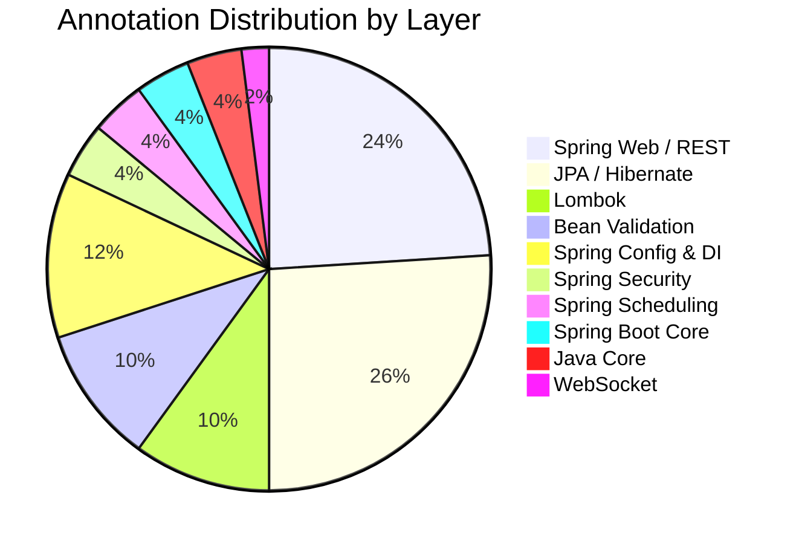

# AgriSense Server — Complete Annotations Report

> [!NOTE]
> This report covers **all 38 Java files** in `agrisense_server/src/main/java/com/agrisense/server/`.
> A total of **42 distinct annotations** are used across the project.

---

## 1. Spring Boot Core

| # | Annotation | Package | Purpose | Used In |
|---|-----------|---------|---------|---------|
| 1 | `@SpringBootApplication` | `org.springframework.boot.autoconfigure` | Combines `@Configuration`, `@EnableAutoConfiguration`, `@ComponentScan`. Entry point of the application. | [AgrisenseServerApplication.java](file:///d:/AgriSense_AI/agrisense_server/src/main/java/com/agrisense/server/AgrisenseServerApplication.java) |
| 2 | `@EnableScheduling` | `org.springframework.scheduling.annotation` | Enables Spring's scheduled task execution capability. | [AgrisenseServerApplication.java](file:///d:/AgriSense_AI/agrisense_server/src/main/java/com/agrisense/server/AgrisenseServerApplication.java) |

---

## 2. Spring Configuration & Bean Definition

| # | Annotation | Package | Purpose | Used In |
|---|-----------|---------|---------|---------|
| 3 | `@Configuration` | `org.springframework.context.annotation` | Marks a class as a source of bean definitions. | [CorsConfig.java](file:///d:/AgriSense_AI/agrisense_server/src/main/java/com/agrisense/server/config/CorsConfig.java), [RestTemplateConfig.java](file:///d:/AgriSense_AI/agrisense_server/src/main/java/com/agrisense/server/config/RestTemplateConfig.java), [SecurityConfig.java](file:///d:/AgriSense_AI/agrisense_server/src/main/java/com/agrisense/server/config/SecurityConfig.java), [WebSocketConfig.java](file:///d:/AgriSense_AI/agrisense_server/src/main/java/com/agrisense/server/config/WebSocketConfig.java) |
| 4 | `@Bean` | `org.springframework.context.annotation` | Declares a method that produces a Spring-managed bean. | [RestTemplateConfig.java](file:///d:/AgriSense_AI/agrisense_server/src/main/java/com/agrisense/server/config/RestTemplateConfig.java), [SecurityConfig.java](file:///d:/AgriSense_AI/agrisense_server/src/main/java/com/agrisense/server/config/SecurityConfig.java) (×2) |
| 5 | `@Value` | `org.springframework.beans.factory.annotation` | Injects values from `application.properties` / `application.yml`. | [CorsConfig.java](file:///d:/AgriSense_AI/agrisense_server/src/main/java/com/agrisense/server/config/CorsConfig.java), [JwtTokenProvider.java](file:///d:/AgriSense_AI/agrisense_server/src/main/java/com/agrisense/server/security/JwtTokenProvider.java) (×2), [WeatherService.java](file:///d:/AgriSense_AI/agrisense_server/src/main/java/com/agrisense/server/service/WeatherService.java) (×2), [MLServiceClient.java](file:///d:/AgriSense_AI/agrisense_server/src/main/java/com/agrisense/server/service/MLServiceClient.java), [GeminiAiService.java](file:///d:/AgriSense_AI/agrisense_server/src/main/java/com/agrisense/server/service/GeminiAiService.java) |
| 6 | `@Component` | `org.springframework.stereotype` | Generic Spring-managed component. | [JwtTokenProvider.java](file:///d:/AgriSense_AI/agrisense_server/src/main/java/com/agrisense/server/security/JwtTokenProvider.java), [JwtAuthenticationFilter.java](file:///d:/AgriSense_AI/agrisense_server/src/main/java/com/agrisense/server/security/JwtAuthenticationFilter.java), [MarketSyncJob.java](file:///d:/AgriSense_AI/agrisense_server/src/main/java/com/agrisense/server/job/MarketSyncJob.java), [WeatherAlertJob.java](file:///d:/AgriSense_AI/agrisense_server/src/main/java/com/agrisense/server/job/WeatherAlertJob.java) |
| 7 | `@Service` | `org.springframework.stereotype` | Specialization of `@Component` for service-layer beans. | [AuthService.java](file:///d:/AgriSense_AI/agrisense_server/src/main/java/com/agrisense/server/service/AuthService.java), [AlertService.java](file:///d:/AgriSense_AI/agrisense_server/src/main/java/com/agrisense/server/service/AlertService.java), [WeatherService.java](file:///d:/AgriSense_AI/agrisense_server/src/main/java/com/agrisense/server/service/WeatherService.java), [MarketService.java](file:///d:/AgriSense_AI/agrisense_server/src/main/java/com/agrisense/server/service/MarketService.java), [GeminiAiService.java](file:///d:/AgriSense_AI/agrisense_server/src/main/java/com/agrisense/server/service/GeminiAiService.java), [MLServiceClient.java](file:///d:/AgriSense_AI/agrisense_server/src/main/java/com/agrisense/server/service/MLServiceClient.java) |
| 8 | `@Repository` | `org.springframework.stereotype` | Specialization of `@Component` for persistence-layer beans. | [UserRepository.java](file:///d:/AgriSense_AI/agrisense_server/src/main/java/com/agrisense/server/repository/UserRepository.java), [FarmProfileRepository.java](file:///d:/AgriSense_AI/agrisense_server/src/main/java/com/agrisense/server/repository/FarmProfileRepository.java), [AlertRepository.java](file:///d:/AgriSense_AI/agrisense_server/src/main/java/com/agrisense/server/repository/AlertRepository.java) |

---

## 3. Spring Web / REST Controller

| # | Annotation | Package | Purpose | Used In |
|---|-----------|---------|---------|---------|
| 9 | `@RestController` | `org.springframework.web.bind.annotation` | Combines `@Controller` + `@ResponseBody`. Every method returns data (JSON). | [AlertController.java](file:///d:/AgriSense_AI/agrisense_server/src/main/java/com/agrisense/server/controller/AlertController.java), [AuthController.java](file:///d:/AgriSense_AI/agrisense_server/src/main/java/com/agrisense/server/controller/AuthController.java), [ChatController.java](file:///d:/AgriSense_AI/agrisense_server/src/main/java/com/agrisense/server/controller/ChatController.java), [CropController.java](file:///d:/AgriSense_AI/agrisense_server/src/main/java/com/agrisense/server/controller/CropController.java), [HealthController.java](file:///d:/AgriSense_AI/agrisense_server/src/main/java/com/agrisense/server/controller/HealthController.java), [IrrigationController.java](file:///d:/AgriSense_AI/agrisense_server/src/main/java/com/agrisense/server/controller/IrrigationController.java), [MarketController.java](file:///d:/AgriSense_AI/agrisense_server/src/main/java/com/agrisense/server/controller/MarketController.java), [PestController.java](file:///d:/AgriSense_AI/agrisense_server/src/main/java/com/agrisense/server/controller/PestController.java), [VoiceController.java](file:///d:/AgriSense_AI/agrisense_server/src/main/java/com/agrisense/server/controller/VoiceController.java), [WeatherController.java](file:///d:/AgriSense_AI/agrisense_server/src/main/java/com/agrisense/server/controller/WeatherController.java) |
| 10 | `@RestControllerAdvice` | `org.springframework.web.bind.annotation` | Global exception handler for all `@RestController` classes. | [GlobalExceptionHandler.java](file:///d:/AgriSense_AI/agrisense_server/src/main/java/com/agrisense/server/exception/GlobalExceptionHandler.java) |
| 11 | `@RequestMapping` | `org.springframework.web.bind.annotation` | Maps HTTP requests to a base URL path for a controller. | All 10 controllers listed above |
| 12 | `@GetMapping` | `org.springframework.web.bind.annotation` | Shortcut for `@RequestMapping(method = GET)`. | AlertController, AuthController, CropController, HealthController, IrrigationController, MarketController (×4), PestController, WeatherController (×3) |
| 13 | `@PostMapping` | `org.springframework.web.bind.annotation` | Shortcut for `@RequestMapping(method = POST)`. | AuthController (×2), ChatController, CropController, IrrigationController, PestController, VoiceController (×2) |
| 14 | `@PutMapping` | `org.springframework.web.bind.annotation` | Shortcut for `@RequestMapping(method = PUT)`. | AuthController (`/api/auth/farm`) |
| 15 | `@PatchMapping` | `org.springframework.web.bind.annotation` | Shortcut for `@RequestMapping(method = PATCH)`. | AlertController (`/{id}/read`), AuthController (`/profile`) |
| 16 | `@DeleteMapping` | `org.springframework.web.bind.annotation` | Shortcut for `@RequestMapping(method = DELETE)`. | AlertController (`/{id}`), ChatController (`/history`) |
| 17 | `@RequestBody` | `org.springframework.web.bind.annotation` | Binds the HTTP request body to a method parameter (JSON → Java object). | AuthController, ChatController |
| 18 | `@RequestParam` | `org.springframework.web.bind.annotation` | Binds query parameters to method arguments. | AlertController, VoiceController, WeatherController |
| 19 | `@PathVariable` | `org.springframework.web.bind.annotation` | Binds a URI template variable to a method parameter. | AlertController (`{id}`), CropController (`{cropName}`), MarketController (`{crop}`), PestController (`{crop}`) |
| 20 | `@ExceptionHandler` | `org.springframework.web.bind.annotation` | Handles specific exception types within `@RestControllerAdvice`. | [GlobalExceptionHandler.java](file:///d:/AgriSense_AI/agrisense_server/src/main/java/com/agrisense/server/exception/GlobalExceptionHandler.java) (×5 — for `IllegalArgumentException`, `MethodArgumentNotValidException`, `MaxUploadSizeExceededException`, `RuntimeException`, `Exception`) |

---

## 4. Spring Security

| # | Annotation | Package | Purpose | Used In |
|---|-----------|---------|---------|---------|
| 21 | `@EnableWebSecurity` | `org.springframework.security.config.annotation.web.configuration` | Enables Spring Security's web security support. | [SecurityConfig.java](file:///d:/AgriSense_AI/agrisense_server/src/main/java/com/agrisense/server/config/SecurityConfig.java) |
| 22 | `@AuthenticationPrincipal` | `org.springframework.security.core.annotation` | Injects the currently authenticated `User` into a controller method parameter. | AlertController (×4), AuthController (×3), ChatController (×1), VoiceController (×1) |

---

## 5. Spring WebSocket

| # | Annotation | Package | Purpose | Used In |
|---|-----------|---------|---------|---------|
| 23 | `@EnableWebSocketMessageBroker` | `org.springframework.web.socket.config.annotation` | Enables WebSocket message handling backed by a message broker (STOMP). | [WebSocketConfig.java](file:///d:/AgriSense_AI/agrisense_server/src/main/java/com/agrisense/server/config/WebSocketConfig.java) |

---

## 6. Spring Scheduling

| # | Annotation | Package | Purpose | Used In |
|---|-----------|---------|---------|---------|
| 24 | `@Scheduled` | `org.springframework.scheduling.annotation` | Marks a method to be run on a fixed schedule. | [MarketSyncJob.java](file:///d:/AgriSense_AI/agrisense_server/src/main/java/com/agrisense/server/job/MarketSyncJob.java) (`fixedRate = 21600000` — every 6 hrs), [WeatherAlertJob.java](file:///d:/AgriSense_AI/agrisense_server/src/main/java/com/agrisense/server/job/WeatherAlertJob.java) (`fixedRate = 3600000` — every 1 hr) |

---

## 7. Spring Transaction Management

| # | Annotation | Package | Purpose | Used In |
|---|-----------|---------|---------|---------|
| 25 | `@Transactional` | `org.springframework.transaction.annotation` | Wraps a method in a database transaction (auto-commit/rollback). | [AuthService.java](file:///d:/AgriSense_AI/agrisense_server/src/main/java/com/agrisense/server/service/AuthService.java) (×3), [AlertService.java](file:///d:/AgriSense_AI/agrisense_server/src/main/java/com/agrisense/server/service/AlertService.java) (×3) |

---

## 8. JPA / Hibernate (Jakarta Persistence)

| # | Annotation | Package | Purpose | Used In |
|---|-----------|---------|---------|---------|
| 26 | `@Entity` | `jakarta.persistence` | Marks a class as a JPA entity (maps to a database table). | [User.java](file:///d:/AgriSense_AI/agrisense_server/src/main/java/com/agrisense/server/model/User.java), [FarmProfile.java](file:///d:/AgriSense_AI/agrisense_server/src/main/java/com/agrisense/server/model/FarmProfile.java), [Alert.java](file:///d:/AgriSense_AI/agrisense_server/src/main/java/com/agrisense/server/model/Alert.java), [ChatMessage.java](file:///d:/AgriSense_AI/agrisense_server/src/main/java/com/agrisense/server/model/ChatMessage.java) |
| 27 | `@Table` | `jakarta.persistence` | Specifies the database table name for an entity. | User (`users`), FarmProfile (`farm_profiles`), Alert (`alerts`), ChatMessage (`chat_messages`) |
| 28 | `@Id` | `jakarta.persistence` | Marks the primary key field. | User, FarmProfile, Alert, ChatMessage |
| 29 | `@GeneratedValue` | `jakarta.persistence` | Configures primary key generation strategy (`GenerationType.UUID`). | User, FarmProfile, Alert, ChatMessage |
| 30 | `@Column` | `jakarta.persistence` | Customizes column mapping (nullable, unique, columnDefinition, updatable, name). | User (×4), FarmProfile (×2), Alert (×3), ChatMessage (×5) |
| 31 | `@OneToOne` | `jakarta.persistence` | Defines a one-to-one relationship. | User (`mappedBy = "user"`), FarmProfile (`fetch = LAZY`) |
| 32 | `@ManyToOne` | `jakarta.persistence` | Defines a many-to-one relationship. | Alert (`fetch = LAZY`) |
| 33 | `@JoinColumn` | `jakarta.persistence` | Specifies the foreign key column. | FarmProfile (`user_id`), Alert (`user_id`) |
| 34 | `@Enumerated` | `jakarta.persistence` | Maps a Java enum to a database column (`EnumType.STRING`). | Alert (`AlertType`) |
| 35 | `@ElementCollection` | `jakarta.persistence` | Maps a collection of basic/embeddable types to a separate table. | FarmProfile (`primaryCrops`) |
| 36 | `@CollectionTable` | `jakarta.persistence` | Specifies the table used for `@ElementCollection`. | FarmProfile (`farm_primary_crops`) |
| 37 | `@CreationTimestamp` | `org.hibernate.annotations` | Automatically sets the field to the current timestamp on entity creation. | User, Alert, ChatMessage |
| 38 | `@UpdateTimestamp` | `org.hibernate.annotations` | Automatically sets the field to the current timestamp on every entity update. | User, FarmProfile |

---

## 9. Lombok

| # | Annotation | Package | Purpose | Used In |
|---|-----------|---------|---------|---------|
| 39 | `@Data` | `lombok` | Generates getters, setters, `toString()`, `equals()`, `hashCode()`. | User, FarmProfile, Alert, ChatMessage, AuthDto (×5 inner classes), ChatDto (×2), CropDto (×3), IrrigationDto (×2), VoiceDto (×2) |
| 40 | `@Builder` | `lombok` | Generates a builder pattern for the class. | User, FarmProfile, Alert, ChatMessage |
| 41 | `@NoArgsConstructor` | `lombok` | Generates a no-argument constructor. | User, FarmProfile, Alert, ChatMessage |
| 42 | `@AllArgsConstructor` | `lombok` | Generates a constructor with all fields. | User, FarmProfile, Alert, ChatMessage |
| — | `@Builder.Default` | `lombok` | Sets a default value for a field when using the Builder. | Alert (`read = false`) |

---

## 10. Bean Validation (Jakarta Validation)

| # | Annotation | Package | Purpose | Used In |
|---|-----------|---------|---------|---------|
| 43 | `@Valid` | `jakarta.validation` | Triggers validation on an incoming `@RequestBody`. | AuthController, ChatController |
| 44 | `@NotBlank` | `jakarta.validation.constraints` | Ensures a string is not null, empty, or whitespace. | AuthDto (×5 fields), ChatDto (×1), IrrigationDto (×2) |
| 45 | `@NotNull` | `jakarta.validation.constraints` | Ensures a value is not null. | IrrigationDto (×3 fields) |
| 46 | `@Email` | `jakarta.validation.constraints` | Validates that the field is a well-formed email address. | AuthDto (×2 fields) |
| 47 | `@Size` | `jakarta.validation.constraints` | Validates the size of a string, collection, or array. | AuthDto (`min=2, max=100` and `min=6`), IrrigationDto (`min=5, max=5`) |

---

## 11. Java Core

| # | Annotation | Package | Purpose | Used In |
|---|-----------|---------|---------|---------|
| 48 | `@Override` | `java.lang` | Indicates a method overrides a superclass/interface method. | CorsConfig, WebSocketConfig (×2), JwtAuthenticationFilter, MLServiceClient |
| 49 | `@SuppressWarnings` | `java.lang` | Suppresses compiler warnings (used with `"unchecked"` for raw type casts). | WeatherService, MarketService, GeminiAiService (×5), WeatherAlertJob |

---

## Summary by Layer

| Layer | Count | Examples |
|-------|------:|---------|
| JPA / Hibernate | 13 | `@Entity`, `@Table`, `@Id`, `@Column`, `@OneToOne`, `@ManyToOne`, etc. |
| Spring Web / REST | 12 | `@RestController`, `@GetMapping`, `@PostMapping`, `@RequestParam`, etc. |
| Spring Config & DI | 6 | `@Configuration`, `@Bean`, `@Value`, `@Component`, `@Service`, `@Repository` |
| Lombok | 5 | `@Data`, `@Builder`, `@NoArgsConstructor`, `@AllArgsConstructor`, `@Builder.Default` |
| Bean Validation | 5 | `@Valid`, `@NotBlank`, `@NotNull`, `@Email`, `@Size` |
| Spring Boot Core | 2 | `@SpringBootApplication`, `@EnableScheduling` |
| Spring Security | 2 | `@EnableWebSecurity`, `@AuthenticationPrincipal` |
| Spring Scheduling | 2 | `@Scheduled`, `@EnableScheduling` |
| Java Core | 2 | `@Override`, `@SuppressWarnings` |
| WebSocket | 1 | `@EnableWebSocketMessageBroker` |
| Transaction | 1 | `@Transactional` |
